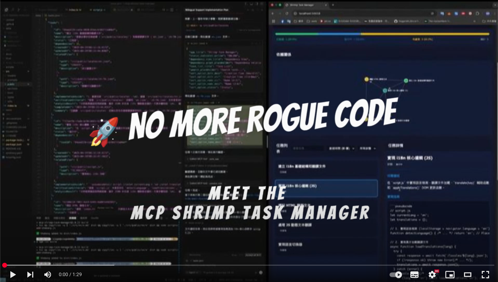

[🇺🇸 English](../../README.md) | [🇩🇪 Deutsch](../de/README.md) | [🇪🇸 Español](../es/README.md) | [🇫🇷 Français](../fr/README.md) | [🇮🇹 Italiano](../it/README.md) | [🇮🇳 हिन्दी](../hi/README.md) | [🇰🇷 한국어](../ko/README.md) | [🇧🇷 Português](../pt/README.md) | [🇷🇺 Русский](../ru/README.md) | [🇨🇳 中文](README.md)

# MCP 蝦米任務管理器

> 🦐 **AI 驅動開發的智能任務管理** - 將複雜專案分解為可管理的任務，跨會話維護上下文，加速您的開發工作流程。

<div align="center">
  
[](https://www.youtube.com/watch?v=Arzu0lV09so)

**[觀看演示視頻](https://www.youtube.com/watch?v=Arzu0lV09so)** • **[快速開始](#-快速開始)** • **[文檔](#-文檔)**

[](https://smithery.ai/server/@cjo4m06/mcp-shrimp-task-manager)
<a href="https://glama.ai/mcp/servers/@cjo4m06/mcp-shrimp-task-manager"></a>

</div>

## 🚀 快速開始

### 前置要求
- Node.js 18+ 
- npm 或 yarn
- 支援 MCP 的 AI 客戶端（Claude Code 等）

### 安裝

#### 安裝 Claude Code

**Windows 11（使用 WSL2）：**
```bash
# 首先，確保已安裝 WSL2（在 PowerShell 中以管理員身份執行）
wsl --install

# 進入 Ubuntu/WSL 環境
wsl -d Ubuntu

# 全域安裝 Claude Code
npm install -g @anthropic-ai/claude-code

# 啟動 Claude Code
claude
```

**macOS/Linux：**
```bash
# 全域安裝 Claude Code
npm install -g @anthropic-ai/claude-code

# 啟動 Claude Code
claude
```

#### 安裝蝦米任務管理器

```bash
# 克隆儲存庫
git clone https://github.com/cjo4m06/mcp-shrimp-task-manager.git
cd mcp-shrimp-task-manager

# 安裝依賴
npm install

# 建構專案
npm run build
```

### 配置 Claude Code

在您的專案目錄中創建 `.mcp.json` 文件：

```json
{
  "mcpServers": {
    "shrimp-task-manager": {
      "command": "node",
      "args": ["/path/to/mcp-shrimp-task-manager/dist/index.js"],
      "env": {
        "DATA_DIR": "/path/to/your/shrimp_data",
        "TEMPLATES_USE": "zh",
        "ENABLE_GUI": "false"
      }
    }
  }
}
```

配置範例：
```json
{
  "mcpServers": {
    "shrimp-task-manager": {
      "command": "node",
      "args": ["/home/fire/claude/mcp-shrimp-task-manager/dist/index.js"],
      "env": {
        "DATA_DIR": "/home/fire/claude/project/shrimp_data",
        "TEMPLATES_USE": "zh",
        "ENABLE_GUI": "false"
      }
    }
  }
}
```

## ✨ 功能特點

### 核心功能
- 🎯 **智能任務規劃** - 將複雜專案自動分解為結構化任務
- 🔗 **依賴管理** - 自動追踪和管理任務間的依賴關係
- 🧠 **記憶系統** - 跨會話保持上下文和專案知識
- 🔍 **研究模式** - 系統性技術調查和知識收集
- 📊 **任務查看器** - 現代化網頁介面用於任務可視化和管理
- 🌐 **多語言支援** - 支援英文和繁體中文模板
- 🤖 **AI 代理整合** - 與專門的 AI 代理無縫協作

## 📖 使用指南

### 基本工作流程

1. **初始化專案規則**
   ```
   "初始化專案規則"
   ```

2. **規劃任務**
   ```
   "規劃任務：實現使用者認證系統"
   ```

3. **執行任務**
   ```
   "執行任務 [任務 ID]"
   ```

4. **驗證完成**
   ```
   "驗證任務 [任務 ID]"
   ```

### 高級功能

#### 🔬 研究模式
進行深入的技術調查：
```
"進入研究模式研究 React 性能優化"
```

#### 🔄 連續模式
自動執行所有排隊任務：
```
"啟用連續模式"
```

#### 🧠 任務記憶
系統自動保存任務歷史供未來參考。存儲在 `memory/` 目錄中，格式為 `tasks_backup_YYYY-MM-DDThh-mm-ss.json`。

## 🖥️ 任務查看器

基於 React 的現代化網頁介面，提供：
- 📋 全面的任務列表視圖
- 🔍 即時搜尋和過濾
- 🎨 拖放式標籤組織
- 🤖 AI 代理管理
- 🔄 可配置的自動刷新
- 📊 專案歷史追踪


### 啟動任務查看器

```bash
cd tools/task-viewer
npm install
npm start
```

訪問 http://localhost:9998 查看介面。

## 🔧 配置

### 環境變數

| 變數 | 描述 | 預設值 |
|------|------|--------|
| `DATA_DIR` | 任務數據存儲目錄 | `./data` |
| `TEMPLATES_USE` | 語言模板（en/zh） | `en` |
| `ENABLE_GUI` | 啟用網頁 GUI | `false` |
| `WEB_PORT` | 網頁 GUI 端口 | 自動 |

### MCP 客戶端配置

#### Cursor IDE

**全域配置（推薦）：**
```json
{
  "mcpServers": {
    "shrimp-task-manager": {
      "command": "node",
      "args": ["/path/to/mcp-shrimp-task-manager/dist/index.js"],
      "env": {
        "DATA_DIR": "/Users/username/ShrimpData",
        "TEMPLATES_USE": "zh",
        "ENABLE_GUI": "true"
      }
    }
  }
}
```

**專案特定配置：**
在專案根目錄創建 `.cursor/mcp.json`：
```json
{
  "mcpServers": {
    "shrimp-task-manager": {
      "command": "npx",
      "args": ["-y", "mcp-shrimp-task-manager"],
      "env": {
        "DATA_DIR": ".shrimp",
        "TEMPLATES_USE": "zh",
        "ENABLE_GUI": "true"
      }
    }
  }
}
```

## 🛠️ 可用工具

| 類別 | 工具 | 描述 |
|------|------|------|
| **規劃** | `plan_task` | 創建新任務 |
| | `analyze_task` | 深度分析任務需求 |
| | `split_tasks` | 拆分複雜任務 |
| **執行** | `execute_task` | 執行任務並提供指導 |
| | `verify_task` | 驗證任務完成 |
| **管理** | `list_tasks` | 列出所有任務 |
| | `query_task` | 搜尋任務 |
| | `get_task_detail` | 獲取任務詳情 |
| | `update_task` | 更新任務 |
| | `delete_task` | 刪除任務 |
| **認知** | `process_thought` | 思維鏈推理 |
| | `reflect_task` | 反思和改進 |
| | `research_mode` | 系統性研究 |
| **專案** | `init_project_rules` | 初始化專案標準 |

## 🏗️ 架構

### 核心組件

```
mcp-shrimp-task-manager/
├── src/
│   ├── index.ts           # MCP 服務器入口
│   ├── models/            # 任務數據模型
│   ├── tools/             # MCP 工具實現
│   │   ├── task/         # 任務管理工具
│   │   ├── thought/      # 認知工具
│   │   ├── research/     # 研究工具
│   │   └── project/      # 專案工具
│   ├── prompts/          # 多語言提示模板
│   └── web/              # 網頁 GUI 服務器
└── tools/task-viewer/    # React 任務查看器
```

### 數據流

```
用戶請求 → MCP 工具 → 任務處理 → 數據持久化 → 響應
                ↓
          提示模板生成
                ↓
          AI 代理執行
```

## 🚀 部署選項

### Docker 部署

```bash
# 使用 Docker Compose
docker-compose up -d

# 或使用 Docker 直接運行
docker run -d \
  --name shrimp-task-manager \
  -p 9998:9998 \
  -v $(pwd)/data:/data \
  cjo4m06/shrimp-task-manager:latest
```

### NPX 快速開始

```bash
# 創建新專案
npx create-shrimp-task-manager my-project

# 或全域安裝
npm install -g @cjo4m06/mcp-shrimp-task-manager
```

### 一鍵安裝腳本

```bash
curl -sSL https://raw.githubusercontent.com/cjo4m06/mcp-shrimp-task-manager/main/install.sh | bash
```

## 📚 文檔

- [提示詞自定義指南](prompt-customization.md)
- [更新日誌](CHANGELOG.md)
- [部署指南](../../DEPLOYMENT.md)
- [API 文檔](../api.md)
- [工具文檔](../tools.md)

## 🤝 貢獻

歡迎貢獻！請查看我們的[貢獻指南](../../CONTRIBUTING.md)。

## 📄 許可證

本專案採用 MIT 許可證 - 詳見 [LICENSE](../../LICENSE) 文件。

## 🙏 致謝

- [Model Context Protocol](https://modelcontextprotocol.io/) 團隊
- [Anthropic](https://www.anthropic.com/) 的 Claude
- 所有貢獻者和使用者

## 🌟 Star History

[](https://www.star-history.com/#cjo4m06/mcp-shrimp-task-manager&Timeline)