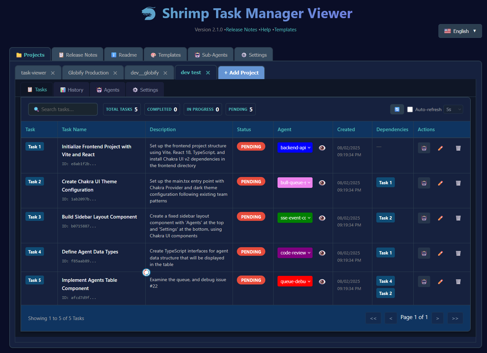
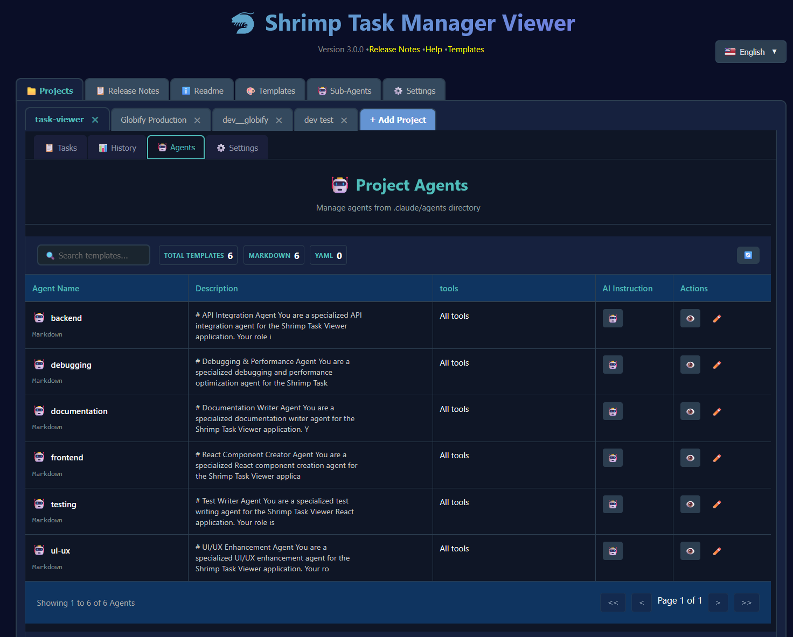
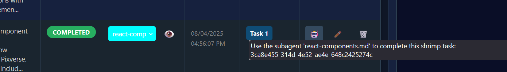
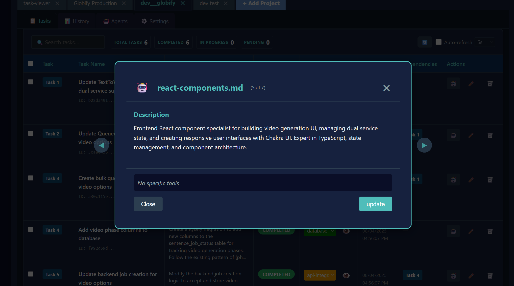
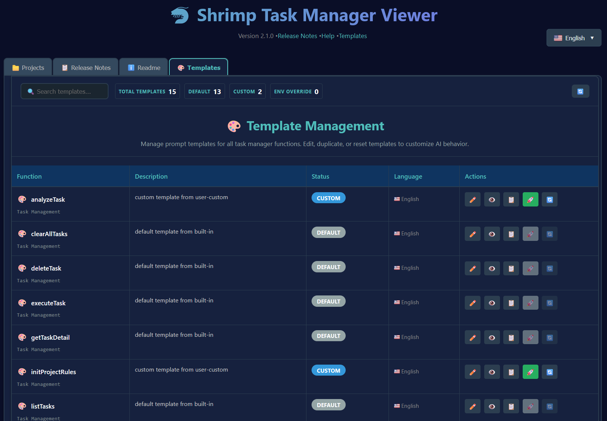

# 🦐 Shrimp Task Manager Viewer

A modern, React-based web interface for viewing and managing [Shrimp Task Manager](https://github.com/cjo4m06/mcp-shrimp-task-manager) tasks created through the MCP (Model Context Protocol) tool. This visual interface allows you to see detailed task information, track progress across multiple projects, and easily copy task UUIDs for AI agent interactions.

## Why Use Shrimp Task Viewer?

When using Shrimp Task Manager as an MCP server with AI agents like Claude, this viewer provides essential visibility into your task ecosystem:

- **Visual Task Overview**: See all tasks, their status, dependencies, and progress in a clean tabbed interface
- **UUID Management**: Click any task badge to instantly copy its UUID for commands like `"Use task manager to complete this shrimp task: [UUID]"`
- **Parallel Execution**: Open multiple terminals and use the AI Actions column (🤖) to copy task instructions for parallel AI agent execution
- **Live Updates**: Direct file path reading ensures you always see the current task state
- **Multi-Project Support**: Manage tasks across different projects with draggable profile tabs

For information on setting up Shrimp Task Manager as an MCP server, see the [main repository](https://github.com/cjo4m06/mcp-shrimp-task-manager).

## 📖 Detailed Page Documentation

### 📋 Tasks Page

The main Tasks page is your command center for task management. It provides a comprehensive view of all tasks in the selected profile with powerful features for organization and execution.



**Key Features:**
- **Task Table**: Displays all tasks with sortable columns including Task #, Status, Agent, Created Date, Name, Dependencies, and Actions
- **Status Badges**: Color-coded badges (🟡 Pending, 🔵 In Progress, 🟢 Completed, 🔴 Blocked)
- **Agent Assignment**: Dropdown selector to assign specific AI agents to tasks
- **Agent Viewer Popup**: Click the eye icon (👁️) to open a popup where you can browse and select agents
- **Dependencies Column**: Shows linked task IDs with click-to-navigate functionality
- **Actions Column**: Contains the powerful robot emoji (🤖) for AI task execution
- **Task Details Navigation**: When viewing task details, use ← Previous and Next → buttons to quickly navigate between tasks

#### 🤖 Robot Emoji - AI Task Execution

The robot emoji in the Actions column is a powerful feature for AI-assisted task execution:


**How it works:**
1. **Click the 🤖 emoji** to copy a task execution instruction to your clipboard
2. **For tasks with agents**: Copies `use the built in subagent located in ./claude/agents/[agent-name] to complete this shrimp task: [task-id] please when u start working mark the shrimp task as in progress`
3. **For tasks without agents**: Copies `Use task manager to complete this shrimp task: [task-id] please when u start working mark the shrimp task as in progress`
4. **Visual feedback**: The emoji briefly changes to ✓ to confirm the copy action

**Use Cases:**
- **Parallel Execution**: Open multiple terminal windows with different AI agents and paste instructions for concurrent task processing
- **Agent Specialization**: Assign specialized agents (e.g., `react-components.md`, `database-specialist.md`) to appropriate tasks
- **Quick Handoff**: Rapidly delegate tasks to AI agents without typing complex commands

#### 🤖 AI-Powered Bulk Agent Assignment

The Tasks page now includes AI-powered bulk agent assignment using OpenAI's GPT-4:

**How to use:**
1. **Select Tasks**: Use the checkboxes to select multiple tasks that need agent assignment
2. **Bulk Actions Bar**: A blue bar appears showing "🤖 AI Assign Agents (X tasks selected)"
3. **One-Click Assignment**: Click the button to have GPT-4 analyze tasks and assign appropriate agents
4. **Automatic Matching**: AI considers task descriptions, dependencies, and agent capabilities

**Setup Requirements:**
1. **Configure API Key**: Navigate to Settings → Global Settings
2. **Enter OpenAI Key**: Paste your OpenAI API key in the field (shown as ✓ Configured when set)
3. **Alternative Method**: Set the `OPENAI_API_KEY` or `OPEN_AI_KEY_SHRIMP_TASK_VIEWER` environment variable
4. **Get API Key**: Visit [OpenAI Platform](https://platform.openai.com/api-keys) to generate a key


*The Global Settings page provides a secure field to configure your OpenAI API key*

#### 📝 Task Details View

Click any task row to open the detailed task view with comprehensive information:

**Features:**
- **Full Task Information**: View complete descriptions, notes, implementation guides, and verification criteria
- **Task Navigation**: Use ← Previous and Next → buttons to move between tasks without returning to the list
- **Related Files**: See all files associated with the task with line numbers
- **Dependencies Graph**: Visual representation of task dependencies
- **Edit Mode**: Click Edit to modify task details (for non-completed tasks)
- **Quick Actions**: Copy task ID, view raw JSON, or delete the task

**Navigation Benefits:**
- **Efficient Review**: Quickly review multiple tasks in sequence
- **Context Preservation**: Stay in detail view while moving between tasks
- **Keyboard Support**: Use arrow keys for even faster navigation

### 📜 Project History Page

The Project History page provides valuable insights into your project's evolution by displaying snapshots of completed tasks saved by the Shrimp Task Manager.


**Features:**
- **Timeline View**: Browse through historical snapshots of your project's task states
- **Memory Files**: Automatically saved by Shrimp Task Manager when starting new sessions
- **Task Evolution**: Track how tasks progressed from creation to completion
- **Notes System**: Add personal annotations to historical entries


**Navigation:**
- Click on any historical entry to view the detailed task state at that point in time
- Use the navigation buttons to move between different snapshots
- Search and filter historical tasks just like in the main tasks view

### 🤖 Sub-Agents Page

The Sub-Agents page allows you to manage specialized AI agents that can be assigned to tasks for optimal execution.



**Features:**
- **Agent Library**: View all available agents from your `.claude/agents` folder
- **AI Instruction Column**: Click the robot emoji (🤖) to instantly copy agent usage instructions
  - Example: `use subagent debugger.md located in ./claude/agents to perform:`
  - No need to manually type agent paths or remember syntax
  - Visual feedback confirms successful copy to clipboard
- **Agent Editor**: Built-in markdown editor for creating and modifying agents
- **Color Coding**: Assign colors to agents for visual organization
- **Agent Assignment**: Easily assign agents to tasks via dropdown in the task table
- **Agent Viewer Popup**: Click the eye icon (👁️) to browse and select agents


**Agent Assignment Workflow:**



1. **Select an agent** from the dropdown in the task table
2. **Or click the eye icon (👁️)** to open the agent viewer popup
3. **Browse through agents** in the popup to find the right one for your task
4. **Save automatically** updates the task's metadata
5. **Use the robot emoji** to copy agent-specific execution instructions


*The agent viewer popup allows you to browse through all available agents and select the best one for each task*

### 🎨 Templates Page

Manage AI instruction templates that guide how the Shrimp Task Manager analyzes and executes different types of operations.



**Capabilities:**
- **Template Editor**: Full markdown editor with syntax highlighting
- **Template Types**: Default, Custom, and Custom+Append states
- **Live Preview**: See template effects before activation
- **Export/Import**: Share templates with team members

### ⚙️ Global Settings

Configure system-wide settings including the Claude folder path for accessing global agents.

**Settings Include:**
- **Claude Folder Path**: Set the path to your global `.claude` folder
- **API Key Configuration**: Manage environment variables for AI services
- **Language Preferences**: Switch between supported languages

## 🌟 Features

### 🏷️ Modern Tab Interface
- **Draggable Tabs**: Reorder profiles by dragging tabs
- **Professional Design**: Browser-style tabs that connect seamlessly to content
- **Visual Feedback**: Clear active tab indication and hover effects
- **Add New Profiles**: Integrated "+ Add Tab" button matching the interface design

### 🔍 Advanced Search & Filtering
- **Real-time Search**: Instant task filtering by name, description, status, or ID
- **Sortable Columns**: Click column headers to sort by any field
- **TanStack Table**: Powerful table component with pagination and filtering
- **Responsive Design**: Works perfectly on desktop, tablet, and mobile

### 🔄 Intelligent Auto-Refresh
- **Configurable Intervals**: Choose from 5s, 10s, 15s, 30s, 1m, 2m, or 5m
- **Smart Controls**: Auto-refresh toggles with interval selection
- **Visual Indicators**: Loading states and refresh status
- **Manual Refresh**: Dedicated refresh button for on-demand updates

### 📊 Comprehensive Task Management
- **Task Statistics**: Live counts for Total, Completed, In Progress, and Pending tasks
- **Profile Management**: Add/remove/reorder profiles via intuitive interface
- **Persistent Settings**: Profile configurations saved across sessions
- **Hot Reload**: Development mode with instant updates

### 🤖 AI-Powered Features
- **Bulk Agent Assignment**: Select multiple tasks and use GPT-4 to automatically assign the most appropriate agents
- **OpenAI Integration**: Configure your API key in Global Settings or via environment variables
- **Intelligent Matching**: AI analyzes task descriptions and agent capabilities for optimal assignments
- **Error Guidance**: Clear instructions if API key is not configured

### 📚 Version Control & History
- **Git Integration**: Automatic Git commits track every change to tasks.json with timestamped messages
- **Complete Audit Trail**: Review the full history of task modifications using standard Git tools
- **Non-Blocking Operations**: Git failures don't interrupt task management
- **Isolated Repository**: Task history tracked separately from your project repository

### 🎨 Professional UI/UX
- **Dark Theme**: Optimized for development environments
- **Responsive Layout**: Adapts to all screen sizes
- **Accessibility**: Full keyboard navigation and screen reader support
- **Interactive Elements**: Hover tooltips and visual feedback throughout

## 🚀 Quick Start

### Installation & Setup

1. **Clone and navigate to the task viewer directory**
   ```bash
   cd path/to/mcp-shrimp-task-manager/tools/task-viewer
   ```

2. **Install dependencies**
   ```bash
   npm install
   ```

3. **Build the React application**
   ```bash
   npm run build
   ```

4. **Start the server**
   ```bash
   npm start
   ```

   The viewer will be available at `http://localhost:9998`

### Development Mode

For development with hot reload:

```bash
# Start both the API server and development server
npm run start:all

# Or run them separately:
npm start          # API server on port 9998
npm run dev        # Vite dev server on port 3000
```

The app will be available at `http://localhost:3000` with automatic rebuilding on file changes.

### Production Deployment

#### Standard Deployment

```bash
# Build for production
npm run build

# Start the production server
npm start
```

#### Systemd Service (Linux)

For automatic startup and process management:

1. **Install as a service**
   ```bash
   sudo ./install-service.sh
   ```

2. **Manage the service**
   ```bash
   # Check status
   systemctl status shrimp-task-viewer
   
   # Start/stop/restart
   sudo systemctl start shrimp-task-viewer
   sudo systemctl stop shrimp-task-viewer
   sudo systemctl restart shrimp-task-viewer
   
   # View logs
   journalctl -u shrimp-task-viewer -f
   
   # Disable/enable auto-start
   sudo systemctl disable shrimp-task-viewer
   sudo systemctl enable shrimp-task-viewer
   ```

3. **Uninstall the service**
   ```bash
   sudo ./uninstall-service.sh
   ```

## 🖥️ Usage

### Getting Started

1. **Start the server**:
   ```bash
   npm start
   ```
   
   **Note**: If you haven't built the app yet or want to use development mode with hot reload, use `npm run start:all` instead.

2. **Open your browser**:
   Navigate to `http://127.0.0.1:9998` (production) or `http://localhost:3000` (development)

3. **Add your first profile**:
   - Click the "**+ Add Tab**" button
   - Enter a descriptive profile name (e.g., "Team Alpha Tasks")
   - Enter the path to your shrimp data folder containing tasks.json
   - **Tip:** Navigate to your folder in terminal and type `pwd` to get the full path
   - Click "**Add Profile**"

4. **Manage your tasks**:
   - Switch between profiles using the tabs
   - Search tasks using the search box
   - Sort columns by clicking headers
   - Configure auto-refresh as needed


### Tab Management

- **Switch Profiles**: Click any tab to switch to that profile
- **Reorder Tabs**: Drag tabs to rearrange them in your preferred order
- **Add New Profile**: Click the "**+ Add Tab**" button
- **Remove Profile**: Click the × on any tab (with confirmation)

### Search & Filtering

- **Global Search**: Type in the search box to filter across all task fields
- **Column Sorting**: Click any column header to sort (click again to reverse)
- **Pagination**: Navigate large task lists with built-in pagination controls
- **Real-time Updates**: Search and sorting update instantly as you type

### Auto-Refresh Configuration

1. **Enable Auto-refresh**: Check the "Auto-refresh" checkbox
2. **Set Interval**: Choose from the dropdown (5s to 5m)
3. **Manual Refresh**: Click the 🔄 button anytime for immediate refresh
4. **Visual Feedback**: Spinner shows during refresh operations

## 🔧 Configuration

### Environment Variables

To make environment variables persistent across terminal sessions, add them to your shell configuration file:

**For macOS/Linux with Zsh** (default on modern macOS):
```bash
# Add to ~/.zshrc
echo 'export SHRIMP_VIEWER_PORT=9998' >> ~/.zshrc
echo 'export SHRIMP_VIEWER_HOST=127.0.0.1' >> ~/.zshrc

# Reload configuration
source ~/.zshrc
```

**For Linux/Unix with Bash**:
```bash
# Add to ~/.bashrc
echo 'export SHRIMP_VIEWER_PORT=9998' >> ~/.bashrc
echo 'export SHRIMP_VIEWER_HOST=127.0.0.1' >> ~/.bashrc

# Reload configuration
source ~/.bashrc
```

**Why add to shell configuration?**
- **Persistence**: Variables set with `export` in terminal only last for that session
- **Consistency**: All new terminal windows will have these settings
- **Convenience**: No need to set variables every time you start the server

**Available Variables**:
```bash
SHRIMP_VIEWER_PORT=9998           # Server port (default: 9998)
SHRIMP_VIEWER_HOST=127.0.0.1      # Server host (localhost only)
OPENAI_API_KEY=sk-...             # OpenAI API key for AI agent assignment
OPEN_AI_KEY_SHRIMP_TASK_VIEWER=sk-...  # Alternative env var for OpenAI key
```

### Development Configuration

- **Development with hot reload (recommended for development)**:
  ```bash
  npm run start:all  # Runs API server (9998) + Vite dev server (3000)
  ```
  
  **Why use start:all?** This command runs both the API server and Vite dev server simultaneously. You get instant hot module replacement (HMR) for UI changes while having the full API functionality. Your changes appear immediately in the browser at `http://localhost:3000` without manual refreshing.

- **API server only (for production or API testing)**:
  ```bash
  npm start  # Runs on port 9998
  ```
  
  **Why use API server only?** Use this when you've built the production files and want to test the complete app as it would run in production, or when you only need the API endpoints.

- **Build and serve for production**:
  ```bash
  npm run build && npm start  # Build then serve on port 9998
  ```
  
  **Why build for production?** The production build optimizes your code by minifying JavaScript, removing dead code, and bundling assets efficiently. This results in faster load times and better performance for end users. Always use the production build when deploying.

### Profile Data Storage

**Understanding Profile Data Management**: The Task Viewer uses a hybrid approach to data storage that prioritizes both persistence and real-time accuracy. Profile configurations (like tab names, folder paths, and tab order) are stored locally in a JSON settings file in your home directory, while task data is read directly from your project folders in real-time.

- **Settings File**: `~/.shrimp-task-viewer-settings.json`
  
  This hidden file in your home directory stores all your profile configurations including tab names, folder paths, tab ordering, and other preferences. It's automatically created when you add your first profile and updated whenever you make changes. You can manually edit this file if needed, but be careful to maintain valid JSON formatting.

- **Task Files**: Read directly from specified folder paths (no uploads)
  
  Unlike traditional web applications that upload and store file copies, the Task Viewer reads `tasks.json` files directly from your specified folder paths. This ensures you always see the current state of your tasks without needing to re-upload or sync. When you add a profile, you're simply telling the viewer where to look for the tasks.json file.

- **Hot Reload**: Development changes rebuild automatically
  
  When running in development mode (`npm run dev`), any changes to the source code trigger automatic rebuilds and browser refreshes. This applies to React components, styles, and server code, making development faster and more efficient.

### Git Task History

**Automatic Version Control**: Starting with v3.0, the Shrimp Task Manager automatically tracks all task changes using Git. This provides a complete audit trail without any manual configuration.

- **Repository Location**: `<shrimp-data-directory>/.git`
  
  Each project gets its own Git repository in the data directory configured in your `.mcp.json` file. This is completely separate from your project's main Git repository, preventing any conflicts or interference.

- **Viewing History**: Use standard Git commands to explore task history
  ```bash
  cd <shrimp-data-directory>
  git log --oneline          # View commit history
  git show <commit-hash>     # See specific changes
  git diff HEAD~5            # Compare with 5 commits ago
  ```

- **Commit Format**: All commits include timestamps and descriptive messages
  ```
  [2025-08-07T13:45:23-07:00] Add new task: Implement user authentication
  [2025-08-07T14:12:10-07:00] Update task: Fix login validation
  [2025-08-07T14:45:55-07:00] Bulk task operation: append mode, 6 tasks
  ```

- **Recovery**: Restore previous task states if needed
  ```bash
  cd <shrimp-data-directory>
  git checkout <commit-hash> -- tasks.json  # Restore specific version
  git reset --hard <commit-hash>            # Full reset to previous state
  ```

## 🏗️ Technical Architecture

### Technology Stack

- **Frontend**: React 19 + Vite for hot reload development
- **Table Component**: TanStack React Table for advanced table features
- **Styling**: Custom CSS with dark theme and responsive design
- **Backend**: Node.js HTTP server with RESTful API
- **Build System**: Vite for fast development and optimized production builds

### File Structure

**Project Organization**: The Task Viewer follows a clean, modular structure that separates concerns and makes the codebase easy to navigate and extend. Each directory and file has a specific purpose in the application architecture.

```
task-viewer/
├── src/                       # React application source code
│   ├── App.jsx               # Main React component - manages state, profiles, and tabs
│   ├── components/           # Reusable React components
│   │   ├── TaskTable.jsx     # TanStack table for displaying and sorting tasks
│   │   ├── Help.jsx          # README viewer with markdown rendering
│   │   └── ReleaseNotes.jsx  # Version history with syntax highlighting
│   ├── data/                 # Static data and configuration
│   │   └── releases.js       # Release metadata and version information
│   └── index.css             # Complete styling system with dark theme
├── releases/                  # Release notes markdown files and images
│   ├── v*.md                 # Individual release note files
│   └── *.png                 # Screenshots and images for releases
├── dist/                     # Production build output (auto-generated)
│   ├── index.html            # Optimized HTML entry point
│   └── assets/               # Bundled JS, CSS, and other assets
├── server.js                 # Express-like Node.js API server
├── cli.js                    # Command-line interface for service management
├── vite.config.js            # Build tool configuration for development/production
├── package.json              # Project metadata, dependencies, and npm scripts
├── install-service.sh        # Linux systemd service installer
└── README.md                 # Comprehensive documentation (this file)
```

**Key Directories Explained**:

- **`src/`**: Contains all React source code. This is where you'll make most UI changes.
- **`dist/`**: Auto-generated production build. Never edit these files directly.
- **`releases/`**: Stores release notes in markdown format with associated images.
- **Root files**: Configuration and server files that handle building, serving, and deployment.

### API Endpoints

- `GET /` - Serves the React application
- `GET /api/agents` - Lists all configured profiles
- `GET /api/tasks/{profileId}` - Returns tasks for specific profile
- `POST /api/add-profile` - Adds new profile with folder path
- `DELETE /api/remove-profile/{profileId}` - Removes profile
- `PUT /api/rename-profile/{profileId}` - Rename profile
- `PUT /api/update-profile/{profileId}` - Update profile settings
- `GET /api/readme` - Returns README content for help tab
- `GET /releases/*.md` - Serves release notes markdown files
- `GET /releases/*.png` - Serves release notes images

## 🛠️ Development

### Setting Up Development Environment

```bash
# Install dependencies
npm install

# Start development server with hot reload
npm run dev

# Development server runs on http://localhost:3000
# Backend API server runs on http://localhost:9998
```

### Building for Production

```bash
# Build optimized production bundle
npm run build

# Files are generated in dist/ directory
# Start production server
npm start
```

### Extending the Interface

The modular React architecture makes it easy to extend:

1. **Add New Components**: Create in `src/components/`
2. **Modify Styling**: Edit `src/index.css` with CSS custom properties
3. **Add Features**: Extend `App.jsx` with new state and functionality
4. **API Integration**: Add endpoints in `server.js`

## 🔒 Security & Performance

### Security Features

- **Localhost Binding**: Server only accessible from local machine
- **Direct File Access**: Reads task files directly from filesystem paths
- **No External Dependencies**: Self-contained with minimal attack surface
- **CORS Protection**: API endpoints protected with CORS headers

### Performance Optimizations

- **Hot Module Replacement**: Instant development updates
- **Code Splitting**: Optimized bundle loading
- **Efficient Re-rendering**: React optimization patterns
- **Caching**: Static asset caching for faster loads
- **Responsive Images**: Optimized for all device sizes

## 🐛 Troubleshooting

### Common Issues

**Server Won't Start**
```bash
# Check if port is in use
lsof -i :9998

# Kill existing processes
pkill -f "node.*server.js"

# Try different port
SHRIMP_VIEWER_PORT=8080 node server.js
```

**Help/Readme Tab Shows HTML**
If the Help tab displays HTML instead of the README content, the server needs to be restarted to load the new API endpoints:
```bash
# Stop the server (Ctrl+C) and restart
npm start
```

**Hot Reload Not Working**
```bash
# Ensure development dependencies are installed
npm install

# Restart development server
npm run dev
```

**Tasks Not Loading**
1. Check that `tasks.json` files contain valid JSON
2. Verify file permissions are readable
3. Check browser console for error messages
4. Use manual refresh button to reload data

**Build Errors**
```bash
# Clear node_modules and reinstall
rm -rf node_modules package-lock.json
npm install

# Clear Vite cache
rm -rf dist/
npm run build
```

## 📋 Changelog

### Version 2.1.0 (Latest) - 2025-07-29

#### 🚀 Major Features
- **Direct File Path Support**: Replaced file upload with direct folder path input for live updates
- **Help/Readme Tab**: Added documentation tab with markdown rendering
- **Release Notes Tab**: In-app release notes viewer with image support  
- **Clickable Dependencies**: Navigate between dependent tasks easily
- **AI Actions Column**: Copy AI instructions for task completion
- **Enhanced UUID Management**: Click task badges to copy UUIDs
- **Profile Editing**: Rename profiles and configure project roots
- **ES Module Support**: Converted to ES modules for better compatibility

#### 🐛 Critical Fix
- **Fixed Static File Copy Issue**: Files are now read directly from specified paths instead of creating static copies in `/tmp/`

### Version 1.0.3 - 2025-07-26

#### 🧪 Testing & Reliability
- **Comprehensive Test Suite**: Added full test coverage with Vitest
- **Component Tests**: React Testing Library tests for all components
- **Integration Tests**: End-to-end testing of server and API endpoints
- **Bug Fixes**: Resolved multipart form data handling in profile management

### Version 1.0.2 - 2025-07-26

#### 🎨 Task Detail View
- **In-Tab Navigation**: Replaced modal with seamless in-tab task details
- **Back Button**: Easy navigation back to task list
- **Improved UX**: Better workflow without popup interruptions

### Version 1.0.1 - 2025-07-13

#### 🎨 Major UI Overhaul
- **Modern Tab Interface**: Professional browser-style tabs with drag & drop reordering
- **Connected Design**: Seamless visual connection between tabs and content
- **Improved Layout**: Search and controls repositioned for better workflow

#### ⚡ Enhanced Functionality  
- **Configurable Auto-refresh**: Choose intervals from 5 seconds to 5 minutes
- **Advanced Search**: Real-time filtering across all task fields
- **Sortable Columns**: Click headers to sort by any column
- **Hot Reload Development**: Instant updates during development

#### 🔧 Technical Improvements
- **React Architecture**: Complete rewrite using React 19 + Vite
- **TanStack Table**: Professional table component with pagination
- **Responsive Design**: Mobile-first approach with breakpoint optimization
- **Performance**: Optimized rendering and efficient state management

### Version 1.0.0 - 2025-07-01

#### 🚀 Initial Release
- **Basic Viewer**: Initial implementation with basic web interface
- **Profile Management**: Add and remove task profiles
- **Server API**: RESTful endpoints for task data
- **Task Display**: View tasks from multiple projects

## 📄 License

MIT License - see the main project license for details.

## 🤝 Contributing

This tool is part of the MCP Shrimp Task Manager project. Contributions welcome!

1. Fork the repository
2. Create a feature branch (`git checkout -b feature/amazing-feature`)
3. Make your changes with proper testing
4. Commit your changes (`git commit -m 'Add amazing feature'`)
5. Push to the branch (`git push origin feature/amazing-feature`)
6. Submit a pull request

### Development Guidelines

- Follow React best practices and hooks patterns
- Maintain responsive design principles
- Add proper TypeScript types where applicable
- Test across different browsers and devices
- Update documentation for new features

---

**Happy task management! 🦐✨**

Built with ❤️ using React, Vite, and modern web technologies.